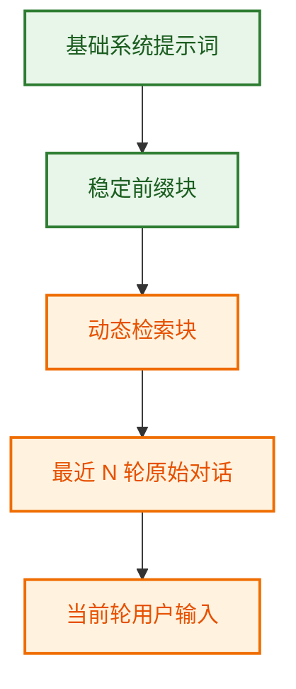
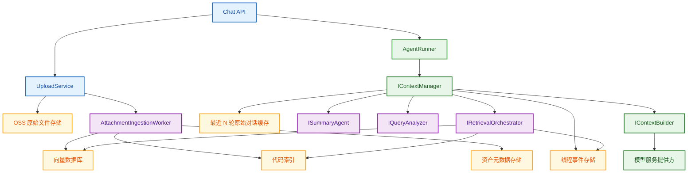
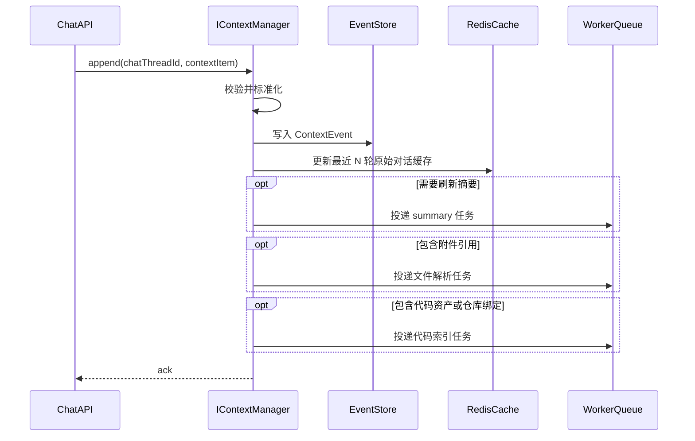
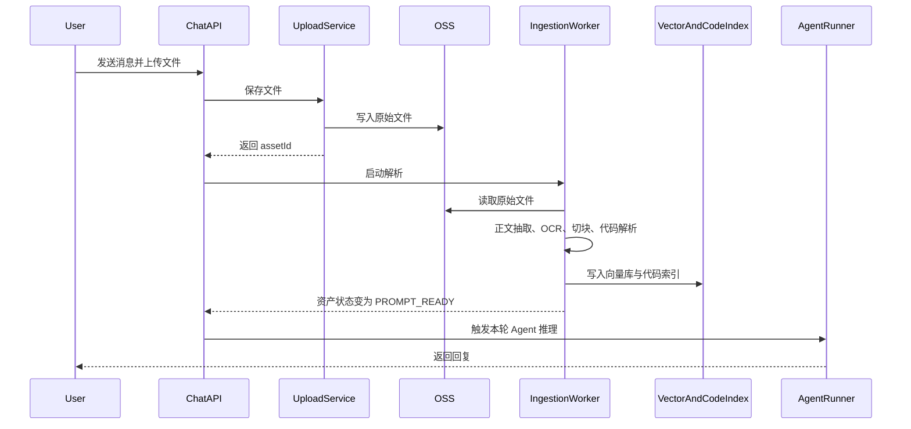
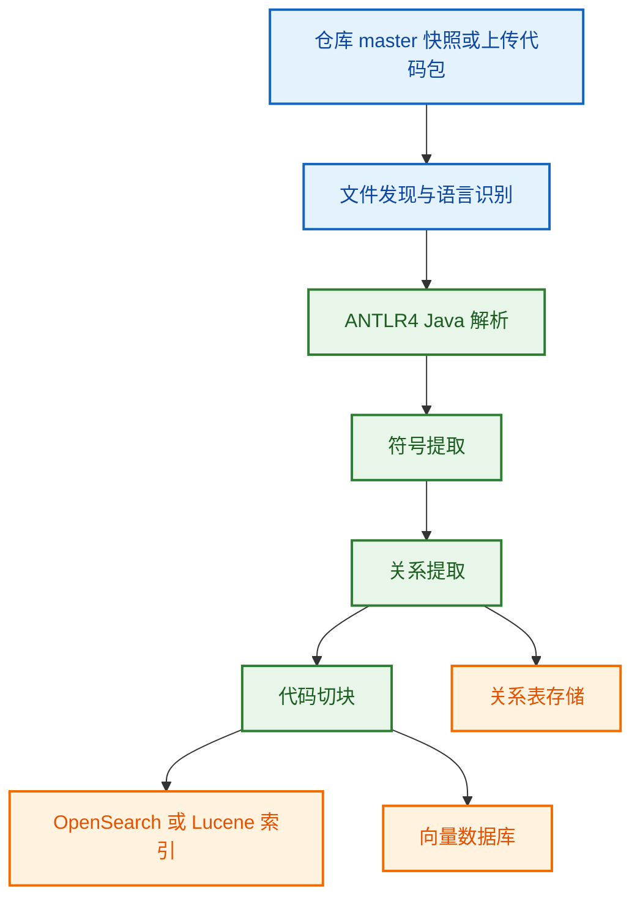
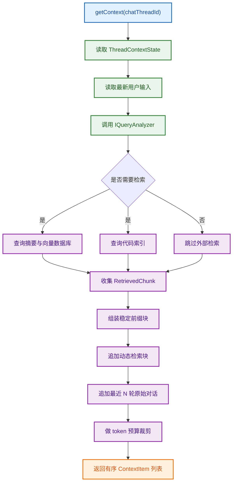
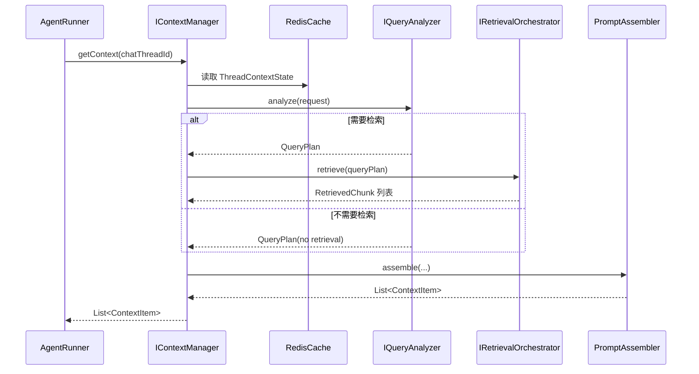

# ContextManager

**文档版本**: V9  
**状态**: Proposed  
**目标仓库**: `gundam-core`  
**默认代码分支**: `master`  
**核心集成点**: `stark.dataworks.coderaider.genericagent.core.runner.AgentRunner#runInternal`

---

## 1. 此系统要解决的痛点

`ContextManager` 不是一个“把聊天记录存得更多”的模块，而是一个**围绕单个对话线程构造系统提示词的线程级检索增强生成（RAG）子系统**。

它要解决的痛点有四类：

### 1.1 长对话天然会丢信息

模型的上下文窗口再大，也不可能无限增长。只靠“把全部聊天记录继续往后拼”会遇到三个问题：

1. 旧信息最终会被窗口裁掉。
2. 重要约束、关键决策、用户偏好会被淹没在大段原始对话里。
3. 模型很容易在长会话里出现“前面说过、后面忘了”的现象。

### 1.2 上传文件如果只记一句话，模型实际上并没有读到内容

如果当前轮只是把“用户上传了一个 PDF/图片/代码压缩包”记成一条文本消息，后续就会出现：

1. 模型不知道文件正文是什么。
2. 不能按页、按段、按图片区域、按代码符号检索。
3. 用户明明上传了资料，但模型回答时像“没看见”。

### 1.3 代码问题不能只靠普通向量检索

对于代码类问题，用户往往不是问“大概讲了什么”，而是在问：

- 某个类、方法、字段定义在哪里；
- 某个异常堆栈对应哪段实现；
- 某个方法被谁调用；
- 某个文件在 `master` 分支里是什么样。

这类问题必须有专门的代码索引，不能只依赖普通文档检索。

### 1.4 系统提示词如果每轮随机拼接，稳定性和性能都会变差

如果每一轮都随意改写系统提示词，代价有两个：

1. 云模型的前缀缓存（Prefix Cache）很难命中；
2. 上下文结构不稳定，模型更容易出现行为漂移。

### 1.5 本设计的核心结论

这份设计的核心结论必须放在最前面：

> **`ContextManager` 的主要职责，是把“最近 N 轮原始对话 + 线程长期记忆 + 上传文件检索结果 + 代码检索结果”稳定地组装成当前这一轮推理所需的系统提示词和上下文列表。**

因此，本文研究的重点不是“如何存消息”，而是：

> **如何围绕单个 `chatThreadId`，把对当前轮真正有用的信息组装成可直接交给 `AgentRunner` 的上下文。**

---

## 2. 设计目标与非目标

### 2.1 设计目标

1. **长效记忆**  
   历史信息不会因窗口限制丢失，通过“摘要 + 最近 N 轮原始对话”的双轨制保持语义连续性。

2. **低延迟**  
   系统提示词前缀尽量稳定，触发云 API 的前缀缓存（Prefix Cache），降低重复请求的前缀预处理开销。

3. **一致性**  
   每轮提示词都基于当前线程的最新状态实时组装，而不是依赖模型自己“猜测之前发生过什么”。

4. **多模态支持**  
   用户上传的文档、图片、代码文件、压缩包等内容都会被解析、切块、索引，并在后续轮次按需检索。

5. **工程可落地**  
   L4 级别工程师读完本文后，应该能够直接按模块拆解并开始编码，而不需要额外口头解释。

6. **明确职责边界**  
   `AgentRunner`、`IContextBuilder`、`IContextManager`、`ISummaryAgent`、检索层、上传解析层各自做什么，必须清晰。

### 2.2 非目标

1. 第一版**不做跨线程的共享记忆网络**。默认作用域是单个 `chatThreadId`。
2. 第一版**不替代 `IContextBuilder`**。`IContextBuilder` 仍负责把 `List<ContextItem>` 渲染为 provider request。
3. 第一版**不替代模型调用层**。主业务 Agent 仍由 `AgentRunner` 驱动。
4. 第一版**不做多分支自动切换**。默认代码检索固定在 `master` 分支，除非线程元数据显式覆盖。
5. 第一版**不追求完整 IDE 级别语义分析**。代码索引先聚焦“足够稳定地支持问答与定位”。

---

## 3. 最终输入结构

### 3.1 最终送给模型的输入结构

推荐把最终输入稳定拆成五层：

1. **基础系统提示词**  
   Agent 自己的系统提示词、开发者提示词、输出协议。

2. **稳定前缀块**  
   当前日期、时区、线程摘要、长期约束、用户偏好、资产目录摘要。

3. **动态检索块**  
   本轮问题触发得到的文档片段、图片说明、代码片段、历史高价值记忆片段。

4. **最近 N 轮原始对话**  
   用户与 Agent 的逐字原文，不做摘要改写。

5. **当前轮用户输入**  
   当前最新问题，永远保留在末尾。

### 3.2 这意味着什么

这意味着：

- **最近 N 轮原始对话**继续直接给 Agent；
- **更早的历史信息**不再以原始聊天记录形式回放，而是经过 `ContextManager` 摘要、检索后转成系统块；
- **上传文件与代码命中的内容**进入系统块时，必须带上**实际内容片段**，而不是只放一个引用符号；
- `ContextManager` 的本质就是：**单线程专用检索增强生成（RAG）与提示词组装器**。

### 3.3 输入分层示意图



---

## 4. 当前 gundam-core 中的位置与职责边界

当前 `gundam-core` 已经把 runtime kernel 的核心职责拆开：

- `AgentRunner` 负责回合推进、模型调用、工具调用、重试、handoff、guardrail；
- `IContextBuilder` 负责把上下文渲染成 provider 可消费的消息结构；
- `IAgentMemory` 是现有的记忆抽象；
- 其他能力例如 tracing、session、tool registry、guardrail 也是独立组件。

因此，这次设计的原则不是“重写整个 runtime”，而是：

> **把 `AgentRunner#runInternal` 里“如何构造当前轮上下文”这一层抽出来，升级为 `IContextManager`。**

### 4.1 改造前后的职责变化

**改造前**

- `runInternal` 直接依赖 `IAgentMemory` 拿历史消息；
- 历史消息的组织方式偏向“消息列表”。

**改造后**

- `runInternal` 先把当前轮输入写入 `IContextManager`；
- `IContextManager` 根据线程最新状态决定本轮应返回哪些 `ContextItem`；
- `IContextBuilder` 再把这些 `ContextItem` 渲染成 provider request。

### 4.2 组件职责边界

| 组件 | 负责什么 | 不负责什么 |
|---|---|---|
| `AgentRunner` | 回合执行、模型调用、工具调用、失败处理 | 不负责长期上下文压缩与检索策略 |
| `IContextManager` | 线程级上下文写入、摘要、检索编排、提示词组装、预算控制 | 不直接调用主业务模型 |
| `IContextBuilder` | 把 `List<ContextItem>` 转换为 provider request | 不决定取哪些历史 |
| `ISummaryAgent` | 把旧历史压缩成结构化摘要快照 | 不负责线程事件存储 |
| `IQueryAnalyzer` | 识别用户意图、做查询改写、选择检索通道 | 不直接渲染提示词 |
| `IAttachmentIngestionService` | 解析上传文件、图片、代码包并建立索引 | 不决定哪些块最终进入提示词 |
| `IRetrievalOrchestrator` | 调用向量数据库、代码索引等检索后端并排序 | 不负责线程事件持久化 |

### 4.3 宏观架构图



---

## 5. 公共接口与核心类型策略

### 5.1 `IContextManager` 的公共接口

接口命名遵循 `gundam-core` 当前偏 C# 的接口命名习惯：

```java
public interface IContextManager
{
    void append(String chatThreadId, ContextItem contextItem);

    List<ContextItem> getContext(String chatThreadId);
}
```

这两个方法的语义必须非常清楚：

- `append`：把新的上下文事件写入线程；
- `getContext`：围绕**线程中最新一条用户输入**，返回当前轮应该送给 `IContextBuilder` 的完整上下文。

### 5.2 对 `ContextItem` 的设计决策

这里直接回答“到底要不要沿用现有 `stark.dataworks.coderaider.genericagent.core.context.ContextItem`”。

本设计的结论是：

> **接口层继续以 `ContextItem` 作为统一上下文单元，但不能机械地原样沿用现有类。正确做法是：升级现有 `ContextItem`，让它成为 `ContextManager` 与 `IContextBuilder` 之间唯一的公共上下文对象。**

也就是说：

- **不建议**再造一个第二份并列的公共 `ContextItem` 类；
- **也不建议**为了少改代码，强行把一个能力不足的旧类硬塞给新设计；
- **建议**直接扩展现有 `ContextItem`，让它足够承载：
    - 普通用户消息；
    - 普通助手消息；
    - tool call / tool result；
    - `ContextManager` 生成的系统块；
    - 附件引用；
    - 元数据。

### 5.3 为什么这样做更正确

因为在 `gundam-core` 里，`ContextItem` 本来就是“上下文组装后交给 `IContextBuilder` 的基本单元”。  
如果这里再引入一个新的公共类，最终只会出现两套公共对象并存的问题：

1. `AgentRunner` 和 `IContextBuilder` 面向旧对象；
2. `ContextManager` 面向新对象；
3. 中间必须做额外对象转换；
4. 系统会长期维护两套公共概念，后续演进会更乱。

更合理的方向是：

> **只保留一套公共上下文对象，但允许这套对象升级。**

### 5.4 建议对 `ContextItem` 增加的能力

如果现有 `ContextItem` 字段不够，建议做**向后兼容扩展**，至少增加以下能力：

```java
public final class ContextItem
{
    // 现有字段保持兼容
    private ContextRole role;                       // USER / ASSISTANT / TOOL / SYSTEM
    private String content;

    // 新增字段
    private String itemId;
    private String name;
    private boolean synthetic;                      // 是否由 ContextManager 生成
    private ContextItemKind kind;                  // NORMAL_MESSAGE / SUMMARY_BLOCK / DOCUMENT_BLOCK / CODE_BLOCK / TOOL_BLOCK
    private List<AttachmentRef> attachments;       // 只存引用，不存原始字节
    private Map<String, String> metadata;          // page, path, lines, assetId, score 等
}
```

```java
public final class AttachmentRef
{
    private String assetId;
    private String fileName;
    private String mimeType;
    private String source;                         // upload / repo / generated
}
```

### 5.5 `ContextItem` 的边界

`ContextItem` 有两个明确边界：

1. **它可以携带引用和元数据，但不能直接携带二进制文件字节。**
2. **它是提示词组装边界对象，不是底层存储对象。**

底层存储、缓存、检索、版本控制应由内部对象负责，而不是把所有实现细节都塞进 `ContextItem`。

---

## 6. 核心内部数据模型

### 6.1 总体原则

内部数据模型分四层：

1. **事件层**：记录线程中发生了什么；
2. **快照层**：记录线程当前状态；
3. **检索层**：记录可以被召回的文档、图片、代码片段；
4. **渲染层**：把以上信息组装成 `ContextItem` 列表。

### 6.2 `ContextEvent`

`append` 写入的权威事件。它是线程级事件日志中的最小记录单元。

```java
public final class ContextEvent
{
    private String eventId;
    private String chatThreadId;
    private long turnNumber;
    private int sequenceInTurn;
    private ContextItem item;
    private String idempotencyKey;
    private long estimatedTokens;
    private Instant createdAt;
}
```

说明：

- `turnNumber`：第几轮问答；
- `sequenceInTurn`：同一轮内的顺序，例如 user -> tool call -> tool result -> assistant；
- `item`：公共层的 `ContextItem`；
- `idempotencyKey`：防重复写入。

### 6.3 `ThreadContextState`

线程当前状态快照。它是 `getContext` 的直接输入之一。

```java
public final class ThreadContextState
{
    private String chatThreadId;
    private long latestTurnNumber;
    private List<ContextItem> recentExactTurns;       // 最近 N 轮原始对话缓存
    private SummarySnapshot latestSummarySnapshot;
    private List<AssetRecord> assets;
    private List<RepoBinding> repoBindings;
    private Instant updatedAt;
}
```

这里明确说明：

> **`recentExactTurns` 就是“最近 N 轮原始对话缓存”，不是别的神秘概念。**

它的含义非常直接：  
**最近几轮用户消息、助手消息、工具消息的原文缓存。**

### 6.4 `SummarySnapshot`

线程长期记忆快照，只覆盖“最近 N 轮之外”的历史。

```java
public final class SummarySnapshot
{
    private String chatThreadId;
    private long coveredUntilTurn;
    private long version;
    private List<String> facts;
    private List<String> decisions;
    private List<String> constraints;
    private List<String> userPreferences;
    private List<String> unresolvedQuestions;
    private List<String> assetRefs;
    private List<String> codeRefs;
    private Instant createdAt;
}
```

### 6.5 `AssetRecord`

统一表示上传文件、图片、代码包、仓库快照等外部资产。

```java
public final class AssetRecord
{
    private String assetId;
    private String chatThreadId;
    private String objectKey;
    private String fileName;
    private String mimeType;
    private AssetType assetType;                    // DOCUMENT / IMAGE / CODE / ARCHIVE
    private AssetStatus status;                    // UPLOADED / PARSING / PROMPT_READY / DEEP_READY / FAILED
    private long sizeBytes;
    private String sha256;
    private String parserVersion;
    private Instant createdAt;
}
```

### 6.6 `RetrievedChunk`

真正进入提示词的检索结果单元。

```java
public final class RetrievedChunk
{
    private String sourceType;                     // SUMMARY / DOCUMENT / IMAGE / CODE
    private String sourceId;                       // assetId 或 symbolId
    private String title;
    private String locator;                        // 页码、段落号、文件路径、行号等
    private double score;
    private String content;                        // 这里必须是实际片段内容
    private Map<String, String> metadata;
}
```

### 6.7 `QueryPlan`

由 `IQueryAnalyzer` 生成，用于告诉 `IRetrievalOrchestrator` 本轮应该查什么。

```java
public final class QueryPlan
{
    private QueryIntent intent;
    private String normalizedQuery;
    private String retrievalQuery;
    private boolean needSummaryRecall;
    private boolean needVectorSearch;
    private boolean needDocumentSearch;
    private boolean needCodeSearch;
    private int vectorTopK;
    private int codeTopK;
    private String branch;
    private List<String> repoScopes;
    private Map<String, String> filters;
}
```

---

## 7. 生产环境存储架构

### 7.1 四层存储

| 层 | 推荐存储 | 作用 |
|---|---|---|
| 原始资产层 | OSS | 存原始文件、图片、代码压缩包、解析派生文件 |
| 事件与元数据层 | MySQL / PostgreSQL | 存线程事件、摘要版本、资产目录、索引元数据 |
| 热缓存层 | Redis | 存最近 N 轮原始对话缓存、可进入提示词状态、幂等键、短时检索缓存 |
| 检索层 | 向量数据库 + 代码索引 | 存文档块、图片描述块、历史高价值块、代码符号与代码片段 |

### 7.2 OSS 存什么

OSS 建议存：

- 原始上传文件；
- 图片的中间派生图；
- OCR 中间结果；
- 解压后的代码包归档；
- 解析失败时的错误快照。

### 7.3 Redis 存什么

Redis 建议存：

- `ThreadContextState` 的热点副本；
- 最近 N 轮原始对话缓存；
- 当前轮上传资产的 `PROMPT_READY` 状态；
- 最近一次稳定前缀文本；
- 检索结果短时缓存；
- 幂等键。

### 7.4 向量数据库存什么

向量数据库建议存：

- 文档正文 chunk；
- OCR chunk；
- 图片说明 chunk；
- 高价值历史记忆 chunk；
- 代码语义 chunk；
- 摘要块的可检索切片。

### 7.5 代码索引存什么

代码索引至少应存：

- 仓库；
- 分支；
- 快照版本；
- 文件路径；
- 符号类型；
- 符号名；
- 方法签名；
- 起止行号；
- 代码片段正文；
- 父子关系；
- 引用关系。

---

## 8. 写路径：`append`

### 8.1 目标

`append` 的目标只有一个：

> **把新的上下文事件可靠写入线程，并触发必要的派生动作。**

它不是提示词组装入口，也不在这里做复杂检索。

### 8.2 `append` 做什么

1. 校验 `chatThreadId` 和 `ContextItem`；
2. 生成或校验幂等键；
3. 估算 token 数；
4. 写入 `ContextEvent`；
5. 更新最近 N 轮原始对话缓存；
6. 标记摘要是否需要刷新；
7. 如果存在附件引用，登记资产并触发解析流程；
8. 如果存在代码资产或仓库绑定，触发代码索引任务。

### 8.3 并发假设

这里明确采用你的业务约束：

> **单个 `chatThreadId` 内没有并发写入；逻辑上始终是串行：用户输入 -> Agent 回复 -> 用户输入 -> Agent 回复。**

因此系统真正需要处理的是：

- 不同线程之间的高并发；
- 多实例部署时的重复投递；
- worker 重试带来的幂等问题。

### 8.4 `append` 时序图



### 8.5 `append` 伪代码

```java
public void append(String chatThreadId, ContextItem contextItem)
{
    validate(chatThreadId, contextItem);

    ContextEvent event = contextEventFactory.create(chatThreadId, contextItem);

    if (idempotencyStore.seen(event.getIdempotencyKey()))
    {
        return;
    }

    eventStore.append(event);
    recentTurnsCache.update(chatThreadId, event);

    if (summaryPolicy.shouldRefresh(chatThreadId, event))
    {
        summaryQueue.enqueue(chatThreadId);
    }

    if (attachmentPlanner.hasAttachments(contextItem))
    {
        assetQueue.enqueue(chatThreadId, contextItem.getAttachments());
    }

    if (codePlanner.shouldIndex(chatThreadId, contextItem))
    {
        codeIndexQueue.enqueue(chatThreadId, contextItem);
    }
}
```

---

## 9. 上传文件与多模态处理

这一节必须非常具体，因为用户体验高度依赖它。

### 9.1 设计原则

如果用户在当前轮上传了文件，系统的行为应该是：

> **先把文件处理到“可以进入提示词”的最低可用状态，再触发 Agent 回复。**

这意味着当前轮不会出现“用户刚上传文件，模型立刻开始回答，但实际上文件还没解析完”的情况。

### 9.2 什么叫“可以进入提示词”的最低可用状态

定义一个资产状态：`PROMPT_READY`。  
它表示该资产已经满足**当前轮回答**的最低要求。

不同类型资产的 `PROMPT_READY` 定义如下：

| 资产类型 | `PROMPT_READY` 的最低要求 |
|---|---|
| 文档 | 已完成正文抽取、基本切块、向量写入 |
| 图片 | 已完成 OCR 或图片说明，已写入向量库 |
| 代码文件 / 代码压缩包 | 已完成代码解包、基础切块、符号索引、向量写入 |
| 表格 | 已完成表头抽取、单元格文本抽取、切块写入 |

更深度的处理，例如整份文档全局摘要、复杂跨文件调用图，可以继续异步做，但**当前轮回答前至少要达到 `PROMPT_READY`**。

### 9.3 当前轮上传文件的整体链路

1. `UploadService` 把原始文件写入 OSS；
2. 生成 `assetId`；
3. 记录 `AssetRecord(status = UPLOADED)`；
4. 启动解析 worker；
5. 解析 worker 完成正文抽取 / OCR / 图片说明 / 代码解析；
6. 完成切块与索引写入；
7. 更新 `AssetRecord(status = PROMPT_READY)`；
8. Chat API 检查本轮全部资产已 `PROMPT_READY`；
9. 只有这时才调用 `AgentRunner` 继续本轮推理。

### 9.4 当前轮上传文件时序图



### 9.5 文件解析器的职责拆分

建议拆成三个阶段：

1. **识别阶段**  
   判断 mime type、文件大小、是否压缩包、是否代码类资产。

2. **内容抽取阶段**  
   文档抽正文；图片做 OCR 和图片说明；代码包做解包和语言识别。

3. **索引阶段**  
   按内容类型写入向量数据库和代码索引。

### 9.6 不同文件类型的处理规则

| 类型 | 内容抽取 | 检索落点 |
|---|---|---|
| PDF / Word / Markdown / TXT | 正文抽取、分页、标题层级抽取 | 向量数据库 |
| 图片 | OCR、图片说明、区域描述 | 向量数据库 |
| Java / XML / YAML / 配置文件 | 文本切块、结构化提取 | 向量数据库 + 代码索引 |
| 代码压缩包 | 解压后逐文件处理 | 向量数据库 + 代码索引 |
| 表格 | 表头与关键单元格抽取 | 向量数据库 |

### 9.7 系统提示词中应该放什么

进入系统提示词的不是“文件存在”这件事本身，而应该是：

- 文件标题和位置；
- 与本轮问题匹配的正文片段；
- 图片说明和 OCR 结果；
- 代码片段和符号信息；
- 必要时的文件级摘要。

### 9.8 系统提示词中不应该只放引用符号

`SummarySnapshot` 或资产目录里存 `assetRef`、`codeRef` 作为引用没有问题；  
但是**渲染到系统提示词时，必须把引用解析成具体内容块**。

也就是说：

- **存储层**可以只保存引用；
- **提示词渲染层**必须把引用对应的正文片段、代码片段真正展开。

这是一个非常关键的边界。

---

## 10. 代码索引：具体到 Java 可实现的方案

这一节明确写到“L4 能直接开始干活”的程度。

### 10.1 为什么需要独立的 `CodeIndex`

代码问题的检索顺序应当是：

1. **精确符号匹配**：类名、方法名、字段名、文件路径、异常堆栈；
2. **结构化过滤**：仓库、分支、文件路径、包名；
3. **语义补充**：对剩余候选做向量召回。

如果没有专门的代码索引，系统只能做“模糊语义搜索”，对于定位类、方法、行号会很不稳定。

### 10.2 第一版只做 Java 优先

因为 `gundam-core` 当前是 Java 项目，所以第一版建议：

- **Java 做到位**；
- 其他语言先走普通文本切块 + 向量检索；
- 未来如果扩展多语言，再把语言前端模块化。

### 10.3 Java 代码索引的推荐实现

Java 解析器建议基于 **ANTLR4** 实现，原因是：

1. 生成式语法树稳定；
2. 便于统一抽取类、方法、字段、注解、继承关系；
3. 对“索引构建”这种只读分析场景足够好；
4. 在 `gundam-core` 当前阶段，比引入整套 IDE 级语义基础设施更轻。

推荐实现方式：

- 使用 ANTLR4 生成 `JavaLexer` 和 `JavaParser`；
- 基于 Parse Tree Listener 或 Visitor 提取结构信息；
- 再做一层“符号归一化”和“关系建立”。

### 10.4 Java 代码索引的处理流水线



### 10.5 解析阶段应该提取什么

第一版至少提取以下结构：

- `package`；
- `import`；
- `class` / `interface` / `enum` / `record`；
- 字段定义；
- 构造函数；
- 方法定义；
- 注解；
- `extends` / `implements`；
- 方法调用表达式；
- 行号范围；
- Javadoc 或前置注释。

### 10.6 建议的 ANTLR4 抽取对象

```java
public final class JavaSymbolDocument
{
    private String repo;
    private String branch;
    private String snapshotId;
    private String path;
    private String packageName;
    private String symbolType;       // CLASS / METHOD / FIELD / CONSTRUCTOR
    private String symbolName;
    private String signature;
    private String parentSymbolId;
    private int startLine;
    private int endLine;
    private String docComment;
    private String codeText;
}
```

```java
public final class JavaRelationEdge
{
    private String fromSymbolId;
    private String toSymbolId;
    private String relationType;     // EXTENDS / IMPLEMENTS / CALLS / DECLARES
}
```

### 10.7 第一版的关系抽取怎么做

第一版不需要追求完整编译级语义解析，可以采用以下策略：

1. **声明关系**  
   直接由语法树得到，例如类声明、方法声明、字段声明。

2. **继承关系**  
   直接由 `extends` / `implements` 子句得到。

3. **方法调用关系**  
   先按当前文件内的可见符号做词法级匹配；
   再结合 `import` 和全局符号表做一次弱解析；
   如果解析不出唯一目标，就保留为“模糊调用关系”，但仍可用于召回。

### 10.8 代码切块策略

代码切块至少需要三层：

1. **文件块**  
   用于回答“这个文件大概干什么”。

2. **类型块**  
   类 / 接口 / 枚举 / record 级别，用于定位大结构。

3. **方法块**  
   方法正文级别，用于回答实现细节。

推荐做法：

- 每个方法独立成块；
- 超长方法再按逻辑段二次切块；
- 每个块必须带路径和行号。

### 10.9 检索时的搜索顺序

`ICodeIndexSearcher` 不应只做一种搜索，而应按以下顺序：

1. **精确搜索**  
   路径、符号名、方法签名、异常堆栈。

2. **字段过滤搜索**  
   包名、文件后缀、目录路径、分支。

3. **BM25 或倒排搜索**  
   处理关键词类查询。

4. **向量搜索**  
   处理“这段代码是干什么的”这类语义问题。

5. **混合排序**  
   把精确匹配分、倒排匹配分、向量分做统一排序。

### 10.10 `ICodeIndexSearcher` 接口建议

```java
public interface ICodeIndexSearcher
{
    List<CodeSearchHit> search(CodeSearchRequest request);
}
```

```java
public final class CodeSearchRequest
{
    private String repo;
    private String branch;
    private String query;
    private List<String> symbolHints;
    private List<String> pathHints;
    private int topK;
}
```

### 10.11 `CodeSearchHit` 建议结构

```java
public final class CodeSearchHit
{
    private String repo;
    private String branch;
    private String path;
    private String symbolName;
    private String symbolType;
    private int startLine;
    private int endLine;
    private double score;
    private String snippet;
    private String matchReason;      // exact_symbol / path / bm25 / vector
}
```

### 10.12 系统提示词中的代码块长什么样

这里一定要有**实际代码内容**，而不是只有路径和符号。

```text
[CODE_CONTEXT]
repo: gundam-core
branch: master
path: src/main/java/.../AgentRunner.java
symbol: runInternal
lines: 210-284
score: 0.97
match_reason: exact_symbol + code_intent
content:
private RunResult runInternal(...)
{
    ...
}
[/CODE_CONTEXT]
```

### 10.13 为什么不是只存引用

因为模型要回答代码问题，必须看到：

- 方法签名；
- 局部逻辑；
- 行号附近的实现；
- 必要时的上下文注释。

只给一个 `AgentRunner#runInternal` 的符号字符串，模型没法可靠分析实现。

---

## 11. `IQueryAnalyzer`：意图识别与查询改写

### 11.1 为什么一定需要它

没有 `IQueryAnalyzer`，`ContextManager` 只能“每轮都去查全部索引”。  
这样会带来三个问题：

1. 延迟上升；
2. 检索噪声变大；
3. 系统提示词中塞入大量无关内容。

因此，`IQueryAnalyzer` 必须先判断：

- 本轮是不是代码问题；
- 本轮是不是在追问历史；
- 本轮是不是在问上传文件；
- 最近 N 轮原始对话是否已经足够；
- 是否需要 query rewrite。

### 11.2 推荐接口

```java
public interface IQueryAnalyzer
{
    QueryPlan analyze(QueryAnalysisRequest request);
}
```

```java
public final class QueryAnalysisRequest
{
    private String chatThreadId;
    private ContextItem latestUserMessage;
    private List<ContextItem> recentExactTurns;
    private SummarySnapshot latestSummarySnapshot;
    private List<AssetRecord> assets;
    private List<RepoBinding> repoBindings;
    private String defaultBranch;
}
```

### 11.3 推荐的两阶段实现

#### 第一阶段：规则引擎

优先做可解释的规则判断：

- 是否出现文件路径；
- 是否出现类名、方法名、包名；
- 是否出现异常堆栈；
- 是否引用“刚才上传的文件”“那个 PDF”“这张图”；
- 是否在追问“前面说过什么”。

#### 第二阶段：小模型改写

当规则无法给出足够清晰的查询表达时，再调用一个小模型做：

- query rewrite；
- 排序补充；
- 过滤条件补充。

这样可以兼顾：

- 低成本；
- 行为可解释；
- 代码问题的稳定性。

### 11.4 推荐的意图分类

| 意图 | 说明 | 典型检索通道 |
|---|---|---|
| `CHIT_CHAT` | 闲聊，最近 N 轮原始对话通常足够 | 不检索 |
| `THREAD_RECALL` | 追问更早历史 | 摘要 + 历史检索 |
| `DOCUMENT_QA` | 询问上传文档 | 文档检索 |
| `IMAGE_QA` | 询问图片 | 图片说明 + OCR 检索 |
| `CODE_QA` | 询问代码实现 | 代码索引 + 代码向量 |
| `DECISION_FOLLOWUP` | 跟进既有约束与决策 | 摘要优先 |
| `TOOL_RESULT_FOLLOWUP` | 接着工具结果追问 | 最近 N 轮原始对话优先 |

### 11.5 触发检索的明确规则

#### 只用最近 N 轮原始对话的情况

满足以下条件时，不需要外部检索：

- 问题只跟最近几轮直接相关；
- 没有出现“更早历史”“上传文件”“代码定位”等信号；
- 最近 N 轮原始对话已包含答题所需事实。

#### 触发文档 / 图片检索的情况

满足任一条件即可：

- 当前轮或历史轮次中有附件；
- 用户明确提到文件名、图片、页码、章节；
- 问题依赖最近 N 轮原始对话之外的文档内容。

#### 触发代码索引的情况

满足任一条件即可：

- 用户问题中出现类名、方法名、字段名、包名、文件路径；
- 用户贴了异常堆栈或编译报错；
- 用户在问“在哪里实现”“怎么改”“谁调用了它”。

### 11.6 查询改写示例

- 用户原问：`这个地方是不是应该替换掉 AgentRunner 里的 IAgentMemory？`
- 规则提取：`AgentRunner`、`IAgentMemory`
- rewrite 后查询：`AgentRunner runInternal IAgentMemory context integration master`

---

## 12. `ISummaryAgent`：独立的摘要 Agent

### 12.1 设计原则

摘要能力应由一个**专门的摘要 Agent**提供，它不依赖 `IContextManager` 自己，也不参与主业务回合。

这意味着：

- 它可以使用单独的 `AgentRunner`；
- 也可以直接使用 `ILlmClient`；
- 它的 memory 可以直接用 `InMemory`；
- 它只关心输入历史与结构化输出。

### 12.2 推荐接口

```java
public interface ISummaryAgent
{
    SummarySnapshot summarize(SummaryRequest request);
}
```

```java
public final class SummaryRequest
{
    private String chatThreadId;
    private SummarySnapshot previousSnapshot;
    private List<ContextEvent> eventsToCompress;
}
```

### 12.3 摘要 Agent 的输入输出边界

**输入**

- 上一版摘要；
- 最近需要压缩的一段旧历史；
- 可选的资产目录摘要。

**输出**

- 新的 `SummarySnapshot`；
- 不直接写线程事件；
- 不直接写提示词；
- 不直接做外部检索。

### 12.4 推荐触发条件

满足任一条件触发摘要刷新：

1. 最近 N 轮原始对话缓存超过上限；
2. 已完成若干完整 turn；
3. 出现新的长期约束、关键决策、用户偏好；
4. 有新的附件解析完成，需要纳入线程长期背景。

### 12.5 为什么摘要不能是大段散文

摘要如果只是长篇自然语言，会有三个问题：

1. 字段不稳定；
2. 关键事实容易漏；
3. 前缀缓存不稳定。

因此摘要必须结构化。

### 12.6 推荐的摘要字段

```json
{
  "coveredUntilTurn": 42,
  "facts": [],
  "decisions": [],
  "constraints": [],
  "userPreferences": [],
  "unresolvedQuestions": [],
  "assetRefs": [],
  "codeRefs": []
}
```

---

## 13. `getContext`：读路径与提示词组装

### 13.1 `getContext` 的目标

`getContext` 必须在一次调用里完成五件事：

1. 读取当前线程最新状态；
2. 获取最新用户输入；
3. 由 `IQueryAnalyzer` 判断本轮是否需要检索；
4. 执行摘要、文档、图片、代码检索；
5. 按顺序与预算组装成 `List<ContextItem>`。

### 13.2 `getContext` 宏观流程图



### 13.3 `getContext` 时序图



### 13.4 `getContext` 伪代码

```java
public List<ContextItem> getContext(String chatThreadId)
{
    ThreadContextState state = stateStore.load(chatThreadId);

    ContextItem latestUserMessage = state.getRecentExactTurns()
        .get(state.getRecentExactTurns().size() - 1);

    QueryPlan queryPlan = queryAnalyzer.analyze(
        new QueryAnalysisRequest(
            chatThreadId,
            latestUserMessage,
            state.getRecentExactTurns(),
            state.getLatestSummarySnapshot(),
            state.getAssets(),
            state.getRepoBindings(),
            options.defaultBranch()
        )
    );

    List<RetrievedChunk> chunks = retrievalOrchestrator.retrieve(chatThreadId, queryPlan);

    return promptAssembler.assemble(state, queryPlan, chunks, options);
}
```

---

## 14. 渲染到系统提示词的具体格式

这一节一定要写清楚，因为 `ContextManager` 最终产物就是系统提示词。

### 14.1 稳定前缀块建议包含什么

稳定前缀建议包括：

1. 基础系统提示词；
2. 当前日期与时区；
3. 线程摘要；
4. 长期约束与用户偏好；
5. 资产目录摘要。

### 14.2 当前日期是否应该进入稳定前缀

应该。

理由是：

- 日期和时区会直接影响用户体验；
- 虽然日期变化会让当天第一次请求无法命中缓存；
- 但同一天内后续请求依然可以稳定命中。

因此本设计明确建议加入：

```text
[CURRENT_TIME]
current_date: 2026-03-08
timezone: Asia/Tokyo
[/CURRENT_TIME]
```

运行时当然要写入**实时日期**，上面只是格式示例。

### 14.3 线程摘要块格式

```text
[THREAD_SUMMARY]
covered_until_turn: 42
facts:
- 当前讨论聚焦 master 分支
- 当前主题是 ContextManager 的设计

decisions:
- 最近 N 轮原始对话直接给 Agent
- 更早历史通过摘要与检索块回注到系统提示词

constraints:
- 单个对话线程内逻辑上串行执行
- 默认代码检索分支为 master

user_preferences:
- 使用中国大陆常用技术表述
- 所有专有名词都要解释
[/THREAD_SUMMARY]
```

### 14.4 文档块格式

注意：这里必须是**实际内容片段**。

```text
[DOCUMENT_CONTEXT]
asset_id: asset-001
file_name: ContextEngineering/Memory.md
hit_count: 2

hit_1:
locator: page=3, chunk=12
score: 0.92
content:
ContextManager 的职责不是保存全部原始聊天，而是围绕当前轮问题组装长期上下文。

hit_2:
locator: page=4, chunk=18
score: 0.88
content:
历史信息需要经过摘要与检索再写入系统提示词，而不是继续追加到最近对话窗口。
[/DOCUMENT_CONTEXT]
```

### 14.5 代码块格式

同样必须带实际代码内容：

```text
[CODE_CONTEXT]
repo: gundam-core
branch: master
path: src/main/java/.../AgentRunner.java
symbol: runInternal
lines: 210-284
score: 0.97
match_reason: exact_symbol + code_intent
content:
private RunResult runInternal(...)
{
    ...
}
[/CODE_CONTEXT]
```

### 14.6 为什么存储层可以只存引用，但提示词层必须展开内容

因为这两个层次解决的是不同问题：

- **存储层**关注可追溯、可重建、可检索，所以引用足够；
- **提示词层**关注模型当前轮能否正确回答，所以必须看到实际片段内容。

---

## 15. 什么时候触发摘要、向量数据库、代码索引

### 15.1 总体原则

不是每轮都查所有索引，而是由 `IQueryAnalyzer` 决定。

### 15.2 触发表

| 场景 | 查摘要 | 查向量数据库 | 查代码索引 |
|---|---|---:|---:|
| 只是接着上一句闲聊 | 否 | 否 | 否 |
| 追问更早历史 | 是 | 可选 | 否 |
| 询问上传文档 | 是 | 是 | 否 |
| 询问图片内容 | 是 | 是 | 否 |
| 询问类、方法、文件、报错 | 是 | 可选 | 是 |
| 让模型基于仓库实现回答 | 是 | 可选 | 是 |

### 15.3 一个关键规则

**代码问题优先查代码索引，再决定是否补充向量召回。**  
不能反过来。

### 15.4 另一个关键规则

**当前轮上传的文件，如果还没 `PROMPT_READY`，本轮就不允许进入 Agent 主推理。**

---

## 16. 上下文窗口参数与 Token 预算

### 16.1 `ContextWindowSize` 必须是构造参数

`ContextWindowSize` 不能写死，必须通过构造参数传入，单位为 tokens。  
这样才能和 200K、256K 等不同模型窗口对齐。

### 16.2 推荐的 options

```java
public record ContextManagerOptions(
    long contextWindowTokens,
    long maxOutputTokens,
    long safetyMarginTokens,
    int recentTurnCount,
    long summaryMaxTokens,
    long retrievalMaxTokens,
    long codeContextMaxTokens,
    int vectorTopK,
    int codeTopK,
    Duration assetPromptReadyTimeout,
    String defaultBranch
) {}
```

### 16.3 基本公式

设：

- `W = contextWindowTokens`
- `O = maxOutputTokens`
- `S = safetyMarginTokens`

则：

```text
usableInputTokens = W - O - S
```

### 16.4 不再使用“神秘百分比”

本设计不再用“summary 占多少百分比、retrieval 占多少百分比”这种难以解释的写法，改为：

1. 先算 `usableInputTokens`；
2. 先放必须存在的块；
3. 再按上限追加可选块；
4. 最后做裁剪。

### 16.5 组装顺序

1. 基础系统提示词；
2. 当前日期与时区；
3. 线程摘要；
4. 动态检索块；
5. 最近 N 轮原始对话；
6. 当前轮用户输入。

### 16.6 裁剪顺序

超过窗口时，按以下顺序裁剪：

1. 低分检索块；
2. 重复文档块；
3. 重复代码块；
4. 摘要中的低价值附属字段；
5. 最后才裁最近 N 轮原始对话。

原则：

> **最近 N 轮原始对话优先级高于检索块。**

### 16.7 200K 与 256K 的默认起始值

这些是**工程默认起始值**，不是固定比例：

#### 200K 示例

```text
contextWindowTokens = 200000
maxOutputTokens = 32000
safetyMarginTokens = 4000
usableInputTokens = 164000
```

推荐起始上限：

- `summaryMaxTokens = 12000`
- `retrievalMaxTokens = 24000`
- `codeContextMaxTokens = 16000`
- `recentTurnCount = 8`

#### 256K 示例

```text
contextWindowTokens = 256000
maxOutputTokens = 32000
safetyMarginTokens = 4000
usableInputTokens = 220000
```

推荐起始上限：

- `summaryMaxTokens = 16000`
- `retrievalMaxTokens = 32000`
- `codeContextMaxTokens = 20000`
- `recentTurnCount = 10`

这些值的依据是：

- 摘要要稳定，但不能膨胀；
- 检索块要足够回答问题，但不能盖过近期对话；
- 代码块单块价值高，所以要单独限额。

---

## 17. 前缀缓存与稳定前缀

### 17.1 稳定前缀应该包含什么

建议把以下内容纳入稳定前缀：

1. 基础系统提示词；
2. 当前日期与时区；
3. 线程摘要；
4. 长期约束；
5. 用户偏好；
6. 输出协议。

### 17.2 哪些内容不应进入稳定前缀

以下内容应当保持动态：

1. 本轮检索结果；
2. 最近 N 轮原始对话；
3. 当前用户输入；
4. 工具刚返回的动态结果。

### 17.3 为什么当前日期可以放进去

因为它是**低频变化但高价值**的信息。  
引入日期只会让：

- 当天第一次请求重建一次前缀；
- 同一天内后续请求继续命中缓存。

这是合理的取舍。

### 17.4 推荐的稳定前缀缓存键

```text
stablePrefixKey =
hash(
    agentSystemPrompt
    + currentDate
    + timezone
    + summaryVersion
    + outputProtocolVersion
)
```

这样做的含义是：

- 日期变了，缓存自然切日；
- 摘要变了，缓存自然失效；
- 系统提示词版本变了，缓存自然失效。

---

## 18. 失败与退化策略

### 18.1 设计原则

任何一个子系统故障，都不应该让整轮对话直接不可用；但也不能让模型假装看过自己其实没看过的内容。

### 18.2 退化顺序

1. 最近 N 轮原始对话足够时，直接回答；
2. summary 可用时，至少注入 summary；
3. 向量数据库不可用时，跳过文档检索；
4. 代码索引不可用时，跳过代码增强；
5. 当前轮上传文件未达到 `PROMPT_READY` 时，不进入主推理。

### 18.3 典型故障场景

| 场景 | 处理方式 |
|---|---|
| `ISummaryAgent` 失败 | 保留上一版摘要，不覆盖 |
| 向量数据库不可用 | 只使用摘要 + 最近 N 轮原始对话 |
| 代码索引不可用 | 只使用摘要 + 最近 N 轮原始对话 + 文档检索 |
| OSS 暂时不可读 | 标记资产失败，不允许假装读过 |
| Redis 丢缓存 | 从事件层重建 `ThreadContextState` |

---

## 19. `AgentRunner` 集成方式

### 19.1 改造目标

`AgentRunner#runInternal` 需要做的，不是“理解摘要、理解检索、理解附件”，而只是：

> **把当前轮输入交给 `IContextManager`，再拿回当前轮应使用的 `ContextItem` 列表。**

### 19.2 推荐调用顺序

1. 创建当前轮用户 `ContextItem`；
2. `append(chatThreadId, userItem)`；
3. `getContext(chatThreadId)`；
4. `IContextBuilder.build(contextItems)`；
5. 模型调用；
6. 把 assistant 输出继续 `append`；
7. 如果中间有 tool call / tool result，也逐个 `append`。

### 19.3 `runInternal` 伪代码

```java
private RunResult runInternal(...)
{
    ContextItem userItem = currentTurnFactory.createUserItem(...);
    contextManager.append(chatThreadId, userItem);

    List<ContextItem> contextItems = contextManager.getContext(chatThreadId);
    ProviderRequest request = contextBuilder.build(contextItems, ...);

    ProviderResponse response = llmClient.chat(request);

    for (ContextItem toolItem : response.generatedToolItems())
    {
        contextManager.append(chatThreadId, toolItem);
    }

    ContextItem assistantItem = response.generatedAssistantItem();
    contextManager.append(chatThreadId, assistantItem);

    return resultMapper.map(response);
}
```

### 19.4 与 `IAgentMemory` 的关系

本设计不主张继续让 `IAgentMemory` 承担“主上下文组装职责”。  
`IAgentMemory` 可以保留，但角色应收缩为：

- 简单场景下的消息缓存；
- 某些独立 Agent 的内存实现；
- `ISummaryAgent` 的 `InMemory` 实现。

主流程的上下文组装，应切换到 `IContextManager`。

---

## 20. 推荐接口清单

```java
public interface IContextManager
{
    void append(String chatThreadId, ContextItem contextItem);
    List<ContextItem> getContext(String chatThreadId);
}

public interface IQueryAnalyzer
{
    QueryPlan analyze(QueryAnalysisRequest request);
}

public interface ISummaryAgent
{
    SummarySnapshot summarize(SummaryRequest request);
}

public interface IAttachmentIngestionService
{
    void ingest(String chatThreadId, String assetId);
}

public interface IRetrievalOrchestrator
{
    List<RetrievedChunk> retrieve(String chatThreadId, QueryPlan queryPlan);
}

public interface ICodeIndexSearcher
{
    List<CodeSearchHit> search(CodeSearchRequest request);
}
```

---

## 21. 推荐包结构

```text
stark.dataworks.coderaider.genericagent.core.context
├── IContextManager
├── DefaultContextManager
├── ContextManagerOptions
├── model
│   ├── ContextEvent
│   ├── ThreadContextState
│   ├── SummarySnapshot
│   ├── AssetRecord
│   ├── RetrievedChunk
│   ├── QueryPlan
│   ├── CodeSearchRequest
│   └── CodeSearchHit
├── analyzer
│   ├── IQueryAnalyzer
│   └── DefaultQueryAnalyzer
├── summary
│   ├── ISummaryAgent
│   └── DefaultSummaryAgent
├── retrieval
│   ├── IRetrievalOrchestrator
│   ├── IVectorSearcher
│   └── ICodeIndexSearcher
├── ingest
│   ├── IAttachmentIngestionService
│   ├── DocumentIngestionWorker
│   ├── ImageIngestionWorker
│   └── CodeIngestionWorker
└── store
    ├── IContextEventStore
    ├── IThreadStateStore
    ├── IRecentTurnsCache
    └── ISummarySnapshotStore
```

---

## 22. L4 工程师的落地顺序

### Phase 1：接入 `AgentRunner`

目标：把上下文来源从 `IAgentMemory` 切到 `IContextManager`。

实现内容：

1. `IContextManager`；
2. `ContextEventStore`；
3. `ThreadContextState`；
4. 最近 N 轮原始对话缓存；
5. `runInternal` 接线。

### Phase 2：摘要能力

实现内容：

1. `ISummaryAgent`；
2. `SummarySnapshot`；
3. 摘要触发策略；
4. 线程摘要块渲染。

### Phase 3：文件上传与向量检索

实现内容：

1. `AssetRecord`；
2. `PROMPT_READY` 状态机；
3. 文档 / 图片解析；
4. 向量数据库写入；
5. 文档块渲染。

### Phase 4：Java 代码索引

实现内容：

1. ANTLR4 Java 解析器；
2. 符号提取；
3. 关系提取；
4. `ICodeIndexSearcher`；
5. 代码块渲染。

### Phase 5：性能与稳定性强化

实现内容：

1. Redis 热缓存；
2. 前缀缓存优化；
3. 失败退化；
4. 指标与 tracing；
5. 重建与补数工具。

---

## 23. 最终结论

`ContextManager` 不是一个“更大的聊天记录容器”，而是：

> **一个围绕单个 `chatThreadId`，把历史记忆、上传文件、代码上下文和最近 N 轮原始对话组装成当前轮系统提示词的线程级检索增强生成（RAG）子系统。**

这一定义带来四个直接后果：

1. 最近 N 轮原始对话继续直接给 Agent；
2. 更早历史通过摘要与检索块进入系统提示词；
3. 当前轮上传文件必须先达到 `PROMPT_READY` 再允许回复；
4. 代码问题必须优先走独立代码索引，而不是只做普通文档检索。

如果按这个边界落地，`gundam-core` 可以在不重写整个 runtime 的前提下，把上下文工程从“消息存储”升级为“系统提示词构造能力”。
