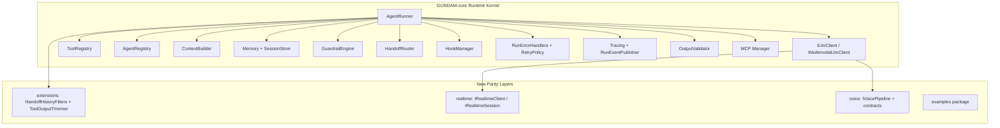

# GUNDAM-core Project Architecture and Code Structure

## 1. Runtime Architecture (Current)

## 2. Comprehensive Comparison with OpenAI Agents SDK

Scope used for comparison:
- OpenAI reference source: `references/openai-agents-python-main/src/agents/**`
- GUNDAM-core source: `src/main/java/stark/dataworks/coderaider/gundam/core/**`

### Feature parity status table

| OpenAI Agents SDK capability | OpenAI reference area | GUNDAM-core implementation | Status |
|---|---|---|---|
| Agent abstraction + registry | `agent.py` | `agent/` (`Agent`, `AgentDefinition`, `AgentRegistry`) | ✅ Implemented |
| Run loop (multi-turn, max-turn) | `run.py`, `run_internal/run_loop.py` | `runner/AgentRunner`, `runner/RunConfiguration` | ✅ Implemented |
| Tool registration + tool calling | `tool.py`, `run_internal/tool_execution.py` | `tool/`, built-ins + runner tool loop | ✅ Implemented |
| Tool approval workflow | `run_internal/approvals.py` | `approval/` + runner integration | ✅ Implemented |
| Handoffs / routing | `handoffs/*`, `realtime/handoffs.py` | `handoff/` + runner handoff flow | ✅ Implemented |
| Guardrails (input/output) | `guardrail.py`, `run_internal/guardrails.py` | `guardrail/` + guardrail exceptions | ✅ Implemented |
| Session persistence abstraction | `memory/session.py` and implementations | `session/ISessionStore`, `InMemorySessionStore` | ✅ Implemented |
| In-memory conversation memory | `memory/session.py` | `memory/InMemoryAgentMemory` | ✅ Implemented |
| Structured output / schema strictness | `strict_schema.py`, `agent_output.py` | `output/` (`OutputValidator`, registry) | ✅ Implemented |
| Run events + stream events | `stream_events.py` | `event/`, `streaming/RunEventPublisher` | ✅ Implemented |
| Tracing provider + processors | `tracing/*` | `tracing/` + `tracing/processor` | ✅ Implemented |
| MCP manager/server/tool mapping | `mcp/*` | `mcp/` + `tool/builtin/mcp/HostedMcpTool` | ✅ Implemented |
| Multimodal message parts + generation contracts | `items.py`, model I/O helpers | `multimodal/` + `IMultimodalLlmClient` | ✅ Implemented |
| Built-in tools (web/file/shell/computer/code/image/video/function) | `computer.py`, `tool.py` ecosystem | `tool/builtin/*` | ✅ Implemented |
| Run error handler pipeline | `run_error_handlers.py`, `run_internal/error_handlers.py` | `runerror/` + runner integration | ✅ Implemented |
| Tool output trimming extension | `extensions/tool_output_trimmer.py` | `extensions/ToolOutputTrimmer` | ✅ Implemented (added) |
| Handoff history filters extension | `extensions/handoff_filters.py` | `extensions/HandoffHistoryFilters` | ✅ Implemented (added) |
| Realtime session contracts | `realtime/*` | `realtime/*` contracts/events/config | 🟨 Partial (contract layer added) |
| Voice workflow contracts | `voice/*` | `voice/*` contracts/config/result | 🟨 Partial (contract layer added) |
| REPL / visualization helpers | `repl.py`, `extensions/visualization.py` | No direct equivalent yet | ❌ Not implemented |
| Provider adapters (OpenAI/Gemini/Qwen/Seed/DeepSeek + Spring AI bridge) | `models/*` | `llmspi/adapter` with OpenAI-compatible adapters + `SpringAiChatClientLlmClient` | ✅ Implemented (initial adapter layer) |

## 3. What was added in this update

1. Added **extensions parity** for OpenAI extension features:
   - `HandoffHistoryFilters`
   - `ToolOutputTrimmer`
2. Added **realtime contract package**:
   - `IRealtimeClient`, `IRealtimeSession`, event model, config
3. Added **voice contract package**:
   - `IVoicePipeline`, `VoiceInput`, `VoiceResult`, `VoicePipelineConfig`, `VoiceException`
4. Added **examples package** with runnable `main` classes (basic -> complex):
   - `Example01SingleSimpleAgent`
   - `Example02AgentWithTools`
   - `Example03AgentWithMcp`
   - `Example04MultiRoundSingleAgentWithToolsAndMcp`
   - `Example05AgentGroupWithHandoffs`
5. Added provider adapters under `llmspi/adapter` for OpenAI-compatible endpoints and a Spring AI bridge:
   - `OpenAiCompatibleLlmClient`, `OpenAiLlmClient`, `GeminiLlmClient`, `QwenLlmClient`, `SeedLlmClient`, `DeepSeekLlmClient`
   - `SpringAiChatClientLlmClient`
6. Added tests for extensions/realtime/voice plus response-conversion tests for tool/handoff mapping.

## 4. Examples package usage

Run examples with Maven exec (or run class from IDE):

- `Example01SingleSimpleAgent` arguments:
  1. `model` (optional)
  2. `baseUrl` (optional placeholder)
  3. `apiKey` (optional placeholder)
  4. `prompt` (optional)
- `Example02AgentWithTools` arguments:
  1. `city` (optional)
- `Example03AgentWithMcp` arguments:
  - no required args
- `Example04MultiRoundSingleAgentWithToolsAndMcp` arguments:
  1. `sessionId` (optional)
- `Example05AgentGroupWithHandoffs` arguments:
  - no required args

These examples are intentionally provider-neutral and use placeholders/mocked model logic so developers can replace them with real `ILlmClient` implementations.

## 5. Example progression (basic -> complex)

The `examples` package now includes a five-step progression:

1. `Example01SingleSimpleAgent`
2. `Example02AgentWithTools`
3. `Example03AgentWithMcp`
4. `Example04MultiRoundSingleAgentWithToolsAndMcp`
5. `Example05AgentGroupWithHandoffs`

## 6. Next parity milestones (recommended)

1. Add concrete realtime transport adapters (WebSocket/SSE) implementing `IRealtimeClient`.
2. Add an end-to-end voice pipeline implementation that uses STT + LLM + TTS providers behind `IVoicePipeline`.
3. Add REPL and graph visualization utility package similar to OpenAI SDK utilities.
4. Add provider adapter modules (`adapters/openai`, `adapters/gemini`, etc.) on top of existing SPI.

## 7. Provider adapter layer (OpenAI / Gemini / Qwen / Seed / DeepSeek)

A new OpenAI-compatible adapter layer is included under `llmspi/adapter`:

- `OpenAiCompatibleLlmClient`
- `OpenAiLlmClient`
- `GeminiLlmClient`
- `QwenLlmClient`
- `SeedLlmClient`
- `DeepSeekLlmClient`
- `SpringAiChatClientLlmClient`

The adapter converts native provider responses into kernel-native `LlmResponse` fields (`content`, `toolCalls`, `handoffAgentId`) while keeping `LlmResponse` unchanged.

Streaming (`chatStream`) is supported through SSE parsing and incremental conversion for text deltas and tool-call fragments.

## 8. Spring AI dependency note

- The project now targets `spring-ai-core` version `1.1.2` in `pom.xml`.
- `SpringAiChatClientLlmClient` provides a bridge from Spring AI `ChatClient` into kernel `ILlmClient` while preserving `LlmResponse` contract.
- The OpenAI-compatible adapters remain available for providers exposing `/chat/completions`-style APIs.
