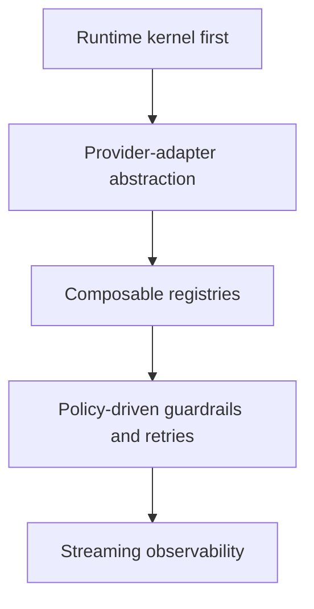
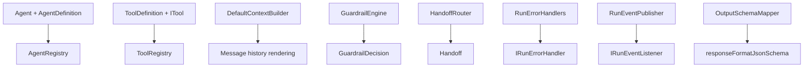
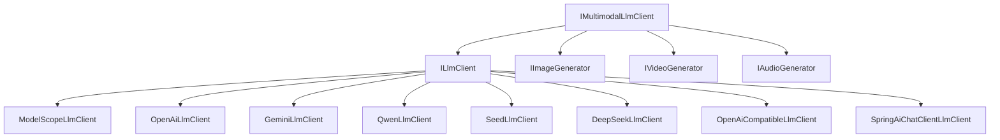
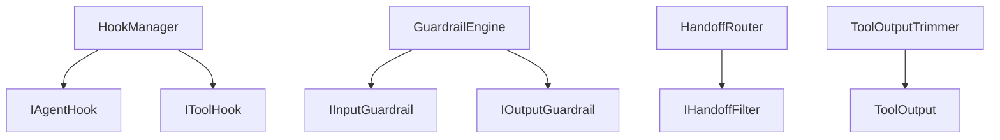
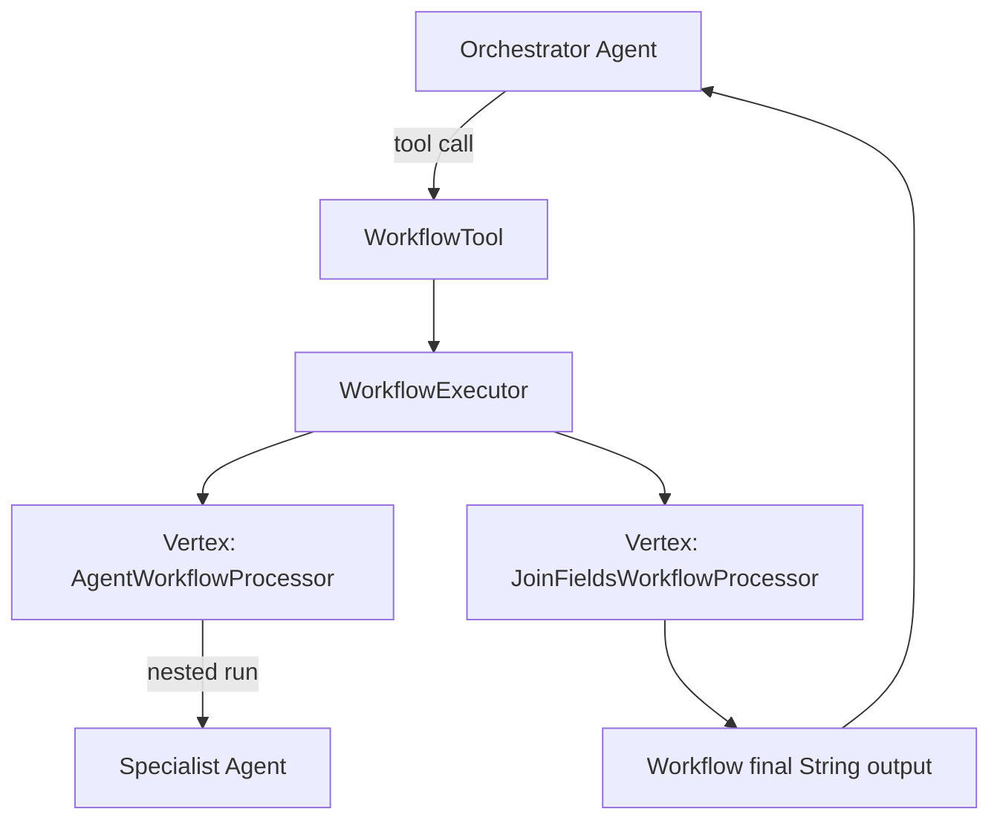

# GUNDAM-core Project Architecture and Code Structure

## 1. Runtime Architecture (Current State)

```mermaid
graph TD
    A[AgentRunner] --> B[IAgentRegistry]
    A --> C[IToolRegistry]
    A --> D[IContextBuilder]
    A --> E[HookManager]
    A --> F[GuardrailEngine]
    A --> G[HandoffRouter]
    A --> H[ISessionStore]
    A --> I[ITraceProvider]
    A --> J[IToolApprovalPolicy]
    A --> K[OutputSchemaRegistry]
    A --> L[OutputValidator]
    A --> M[RunEventPublisher]

    A --> N[ILlmClient]
    N --> O[LlmRequest]
    N --> P[LlmResponse]

    A --> Q[RunConfiguration]
    A --> R[RunnerContext]
    R --> S[IAgentMemory]
    R --> T[TokenUsage]
    R --> U[RunItem timeline]

    A --> V[Tool call loop]
    V --> W[ITool]
    V --> X[ToolApprovalRequest/ToolApprovalDecision]
``` 

## 2. Design Principles

```mermaid
graph TD
    A[Runtime kernel first] --> B[Provider-adapter abstraction]
    B --> C[Composable registries]
    C --> D[Policy-driven guardrails and retries]
    D --> E[Streaming observability]
``` 

## 3. Key Components

```mermaid
graph TD
    A[Agent + AgentDefinition] --> B[AgentRegistry]
    C[ToolDefinition + ITool] --> D[ToolRegistry]
    E[DefaultContextBuilder] --> F[Message history rendering]
    G[GuardrailEngine] --> H[GuardrailDecision]
    I[HandoffRouter] --> J[Handoff]
    K[RunErrorHandlers] --> L[IRunErrorHandler]
    M[RunEventPublisher] --> N[IRunEventListener]
    O[OutputSchemaMapper] --> P[responseFormatJsonSchema]
``` 

## 4. Provider Agnostic Layer

```mermaid
graph TD
    A[ILlmClient] --> B[ModelScopeLlmClient]
    A --> C[OpenAiLlmClient]
    A --> D[GeminiLlmClient]
    A --> E[QwenLlmClient]
    A --> F[SeedLlmClient]
    A --> G[DeepSeekLlmClient]
    A --> H[OpenAiCompatibleLlmClient]
    A --> I[SpringAiChatClientLlmClient]

    J[IMultimodalLlmClient] --> A
    J --> K[IImageGenerator]
    J --> L[IVideoGenerator]
    J --> M[IAudioGenerator]
``` 

## 5. Extension Points

```mermaid
graph TD
    A[HookManager] --> B[IAgentHook]
    A --> C[IToolHook]
    D[GuardrailEngine] --> E[IInputGuardrail]
    D --> F[IOutputGuardrail]
    G[HandoffRouter] --> H[IHandoffFilter]
    I[ToolOutputTrimmer] --> J[ToolOutput]
```

## 6. Agent and Workflow Composition Patterns

```mermaid
graph TD
    A[Orchestrator Agent] -->|tool call| B[WorkflowTool]
    B --> C[WorkflowExecutor]
    C --> D[Vertex: AgentWorkflowProcessor]
    D -->|nested run| E[Specialist Agent]
    C --> F[Vertex: JoinFieldsWorkflowProcessor]
    F --> G[Workflow final String output]
    G --> A
```

### Composition rules

- **Agent as a tool**: `AgentTool` wraps an agent invocation so another agent can delegate to it using normal tool-calling.
- **Workflow as a tool**: `WorkflowTool` exposes a workflow DAG as a callable tool for an agent.
- **Agent as a workflow step**: `AgentWorkflowProcessor` executes a workflow vertex by delegating that step to an agent.
- **Result contract**: workflow outputs are normalized to a final `String` so they can be consumed directly by the calling agent.
